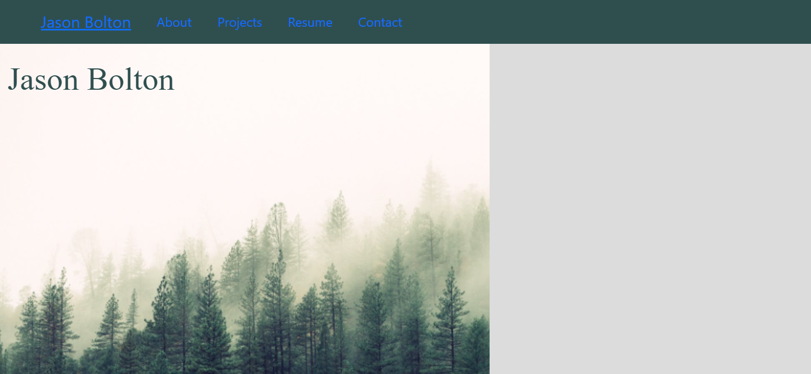
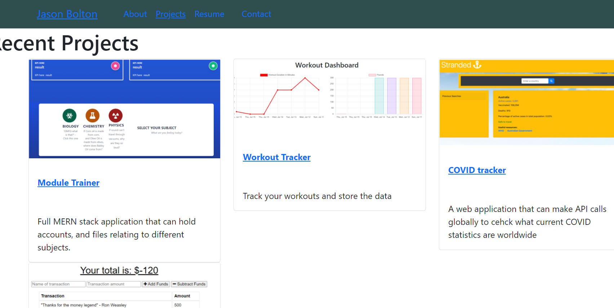

# React Portfolio 

  
  
  #### Table of Contents
  * [Project Description](#project-description)
  * [Installation Instructions](#installation-instructions)
  * [Test Instructions](#test-instructions)
  * [Screenshots](#screenshots)
  * [Usage Guidelines](#usage-guidelines)
  * [License](#license)
  * [Contribution Guidelines](#contribution-guidelines)
  * [Questions](#questions)

  ## Project Description 
  A React porftolio which I will be adding to shortly. Contains a home page, recent projects page, my CV, and other infromation. First project using React.

  ## Installation Instructions
  * npm install 

  ## Test Instructions
  * npm start

  ## Screenshots

  Home Page 
  

  Recent Projects Page
   

  ## Usage Guidelines
  * To see deployed app:
   https://github.com/Jbolton89/react-portfolio

  ## Credits
  * Jbolton89

  ## Contribution Guidelines
  * All contributions welcome! 

  

  ## Questions
  You can contact me directly at jasonbolton89@gmail.com.  
  You can find more of my work at [jbolton89](http://github.com/jbolton89).